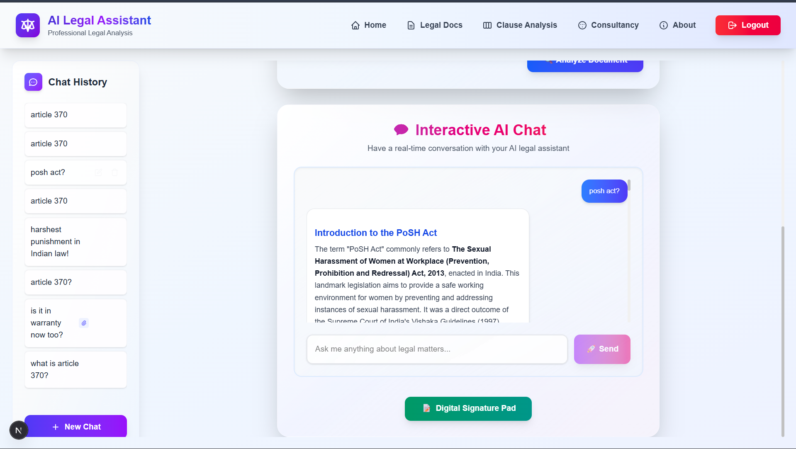
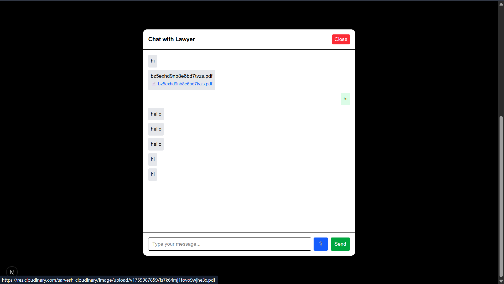
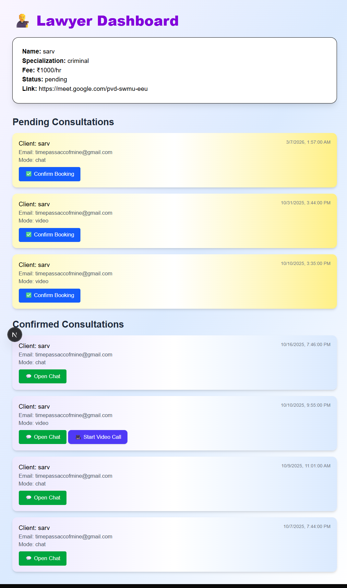
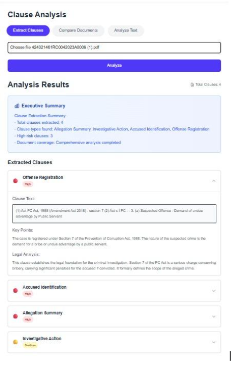
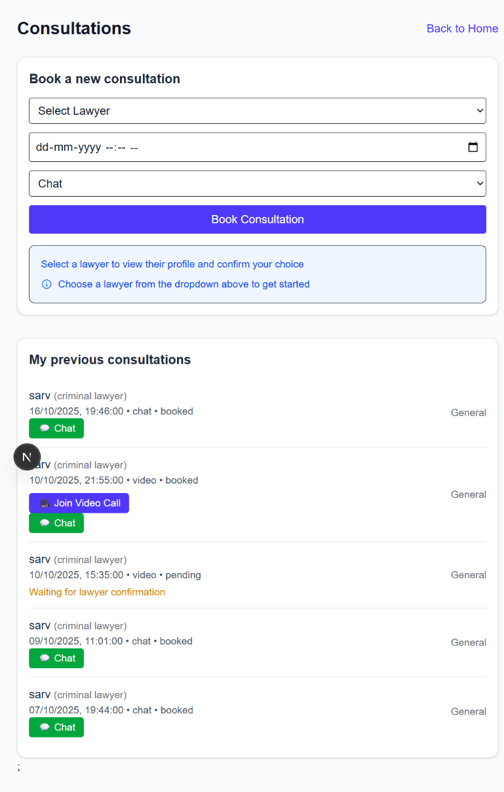

# ⚖️ Hybrid AI Legal Assistant
 
A full-stack legal-tech platform that connects **clients and lawyers** while using **Gemini-powered semantic retrieval** to answer legal questions, extract clauses, and compare contracts — built on a Next.js/FastAPI hybrid architecture.
 
> 🔗 **Repo:** [Sarvesh-Jangam/Hybrid-AI-Legal-Assistant](https://github.com/Sarvesh-Jangam/Hybrid-AI-Legal-Assistant)
 
---
 
## 🧠 What It Does
 
This project blends two things legal-tech usually treats separately: an **AI research assistant** for understanding documents, and a **consultation marketplace** for actually talking to a lawyer.
 
- **Ask questions about a legal document** (uploaded PDF or an existing indexed one) and get answers grounded in the actual text, not hallucinated.
- **Extract and compare clauses** across two contracts to spot differences.
- **Sign PDFs digitally** right in the browser and save the signed copy.
- **Book and run consultations** with a lawyer over chat or video, with history saved per client.
- **"Defend a case"** — a dedicated flow for building an argument off retrieved legal context.

## ✨ Key Features
 
### 🔍 Semantic Document Q&A
Uploaded documents are chunked, embedded with Gemini, and stored in per-document Qdrant collections. Questions are answered via similarity search over those collections rather than the raw document — so answers stay grounded in the source. If a PDF's text can't be extracted with standard OCR, the pipeline falls back to Gemini's vision OCR before giving up.
 
### 📑 Clause Extraction & Document Comparison
A dedicated clause extractor pulls structured clauses out of a document (or raw text), and a comparison endpoint takes two documents and highlights how their clauses differ — useful for reviewing contract redlines.
 
### ✍️ Digital Signature Embedding
A canvas-based signature pad lets a user draw a signature, which is then stamped onto the PDF client-side using `pdf-lib` and exported as a new signed file — no server round-trip needed for the signing step itself.
 
### 💬 Lawyer–Client Consultations
Clients can book a consultation in **chat**, **call**, or **video** mode. Video consultations are handled via a generated meeting link (Google Meet), while chat consultations persist full message history in MongoDB, tied to the client, lawyer, and consultation record.
 
### 🕓 Persistent Chat History
Every AI conversation — whether general Q&A or tied to a specific document — is saved and retrievable, so a client can pick up a prior legal research thread without re-uploading anything.

# 🏗️ Architecture

```
                              Client (Browser)
                                      │
                                      │
                        React Components (Next.js)
                                      │
                                      ▼
              ┌─────────────────────────────────────┐
              │     Next.js Backend (API Routes)    │
              │-------------------------------------│
              │ • Authentication                    │
              │ • User Management                   │
              │ • MongoDB Operations                │
              │ • Chat History                      │
              │ • File Upload                       │
              │ • Calls FastAPI AI APIs             │
              └───────────────┬───────────────┬─────┘
                              │               │
                              │               │
                              ▼               ▼
                      MongoDB Database    FastAPI AI Backend
                    (Users & Chats)      (Python + LangChain)
                                              │
                           ┌──────────────────┴──────────────────┐
                           │                                     │
                           ▼                                     ▼
                  Google Gemini API                  Qdrant Vector Database
                (LLM + Embeddings)                 (Semantic Search Index)
```

---

## ER Diagram
> 

## ⚙️ Tech Stack
 
| Layer | Technology |
|---|---|
| Frontend | Next.js 15 (App Router), React 19, Tailwind CSS |
| Auth | Clerk |
| Backend / AI service | FastAPI, LangChain |
| LLM & Embeddings | Google Gemini (`gemini-2.5-flash` for reasoning, Gemini embeddings for retrieval, Gemini OCR as a fallback) |
| Vector Database | Qdrant |
| Database | MongoDB (Mongoose) |
| File handling | pdf-lib, pdfjs-dist, signature_pad, Cloudinary, PyMuPDF / pytesseract / `unstructured` (OCR + parsing) |
| Communication | REST APIs between frontend and AI service |
| DevOps | Docker |

---

# 📂 Project Structure

```
Hybrid-AI-Legal-Assistant/
├── ai-model/                # FastAPI service
│   ├── main.py               # Endpoints: ask, chat, extract-clauses, compare-clauses, defend-case...
│   ├── utils/
│   │   ├── clause_extractor.py
│   │   ├── query_agent.py
│   │   └── summarization.py
│   └── requirements.txt
└── src/app/                 # Next.js App Router
    ├── api/                  # ai/, chats/, consultations/, lawyer(s)/, client/, messages/
    ├── components/           # incl. PDFSigner
    ├── models/               # Mongoose schemas: user, lawyer, client, consultation, payment, chat...
    ├── consultancy/          # booking + consultation UI
    ├── clause-analysis/
    ├── defend-case/
    └── legal-documents/
```

---

## ✨ Features

### 🤖 AI Legal Consultation
- AI-powered legal assistance using Google Gemini
- Context-aware legal question answering with RAG
- Natural language interaction with legal documents

### 📄 Document Intelligence
- Upload and process PDF legal documents
- Semantic document retrieval
- Clause extraction
- Legal document comparison
- Digital signature embedding

### 💬 Lawyer–Client Platform
- Persistent chat history
- Lawyer-client consultation
- Video consultation support
- Secure document management

### ⚡ AI Pipeline
- Google Gemini LLM
- Retrieval-Augmented Generation (RAG)
- Vector similarity search
- Qdrant semantic indexing

---


# 📋 Prerequisites

Before running the project, ensure the following are installed:

- Python 3.12+
- Node.js 20+
- Docker Desktop
- MongoDB Atlas
- Qdrant Cloud
- Google Gemini API Key

---

# ⚙️ Environment Variables

## Backend (`ai-model/.env`)

```env
GEMINI_API_KEY=

QDRANT_URL=

QDRANT_API_KEY=

POPPLER_PATH=

TESSERACT_PATH=
```

---

## Frontend (`frontend/.env.local`)

```env
FASTAPI_URL=http://localhost:8000

NEXT_PUBLIC_FASTAPI_URL=http://localhost:8000

MONGODB_URI=

DB_NAME=

CLOUDINARY Keys....

Clerk Keys......
```

---

# 🚀 Running Locally

## Clone Repository

```bash
git clone https://github.com/Sarvesh-Jangam/Hybrid-AI-Legal-Assistant.git

cd Hybrid-AI-Legal-Assistant
```

---

## Backend

```bash
cd ai-model

pip install -r requirements.txt

uvicorn main:app --reload
```

Backend:

```
http://localhost:8000
```

Swagger:

```
http://localhost:8000/docs
```

---

## Frontend

```bash
cd frontend

npm install

npm run dev
```

Frontend:

```
http://localhost:3000
```

---

# 🐳 Docker

## Build Images

Backend

```bash
docker build -t timepassaccofmine/legalagent-fastapibackend:latest ./ai-model
```

Frontend

```bash
docker build -t timepassaccofmine/legalagent-frontend:latest ./frontend
```

---

## Run Containers

Backend

```bash
docker run -d \
-p 8000:8000 \
--env-file ai-model/.env \
--name fastapi-backend \
timepassaccofmine/legalagent-fastapibackend:latest
```

Frontend

```bash
docker run -d \
-p 3000:3000 \
--env-file frontend.env \
--name frontend \
timepassaccofmine/legalagent-frontend:latest
```

---

## Docker Compose

```bash
docker compose up --build
```

---

# ☁️ Deployment

The application has been containerized and deployed using:

- Docker
- Docker Hub
- AWS EC2

Deployment flow:

```
Developer
    │
    ▼
Docker Build
    │
    ▼
Docker Hub
    │
    ▼
AWS EC2
    │
    ▼
Docker Containers
    │
    ▼
Public Web Application
```

---

# 📌 API Endpoints

| Endpoint | Description |
|-----------|-------------|
| `/chat` | General legal consultation |
| `/ask-existing` | Query legal knowledge base |
| `/ask-context` | Query uploaded documents |
| `/extract-clauses` | Clause extraction |
| `/compare-clauses` | Legal document comparison |
| `/save-chat` | Store chat history |

---

# 📷 Screenshots

> 
  
  
  
  
  
  
```
And Many more features and functionalities!
```

---


# 👨‍💻 Author

**Sarvesh Mangesh Jangam**
